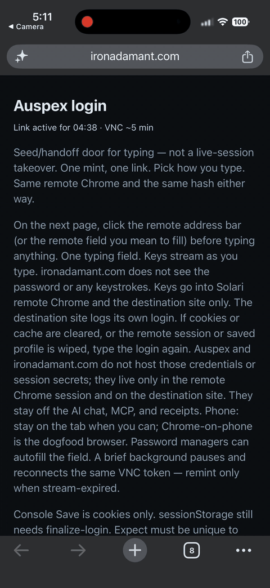
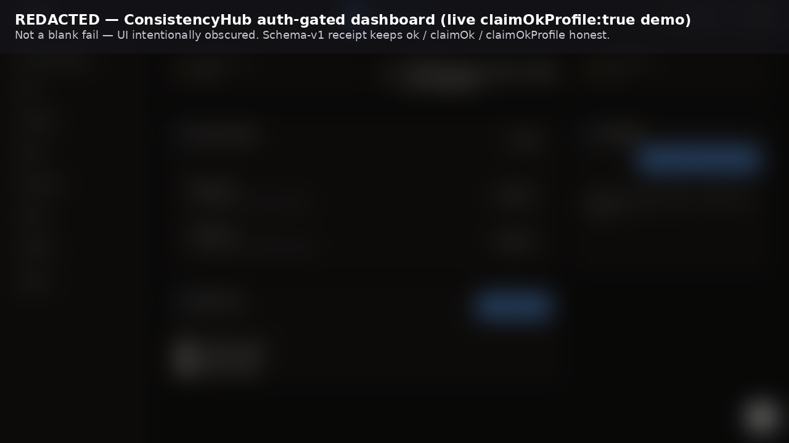

# Auspex

Auspex checks a live web page in Solari cloud Chrome (a browser Solari runs in their cloud, not on your computer). It looks for the words you asked for, then checks again on a second machine. It tells you whether the page is really logged in, so an agent does not start work on a login screen. It does not click around while you are logged in.

## For Reviewers

Watch with no clone and no API key: https://ironadamant.com/auspex/ — the landing opens on the blurred redacted demo and the three results. The player lower on the page is the stripped Microsoft wall, not logged-in proof. The Pages landing has a short Agent door card beside the phone login door.

The command people paste first, `npx auspex-solari check --name ironadamant`, is a **measured public check**: a public page, no login. It does **not** prove logged-in honesty. From Cursor: `npx -p auspex-solari auspex-mcp`.

**Auth-gated evidence** is a redacted auth-gated SaaS demo, receipt [`consistencyhub-receipt.json`](examples/auspex-ts/demo/consistencyhub-receipt.json). The blur hides personal data. That file is evidence from one finished sign-in, not the steps for your site.

Your site: `login --url <https>` (Auspex names the saved login from the site address; override `--profile <yours>`). We do not claim Alice-vs-Bob wrong-account detection: a saved login can still be the wrong Microsoft user and still match the words you asked for. Auspex never types passwords. Never `--record` a logged-in session.

**Issues** is on. The weekly public job still skips if the secret is unset. Do not remove it. Repo `SOLARI_API_KEY` is **present** (masked). Observed: [Actions 35605123361](https://github.com/IronAdamant/auspex/actions/runs/35605123361) (2026-09-21) ironadamant + checkpoint `ok: true`.

### Three results

Read each one on its own.

- `ok` — The browser Auspex just opened found the words you asked for, and the second check passed when it ran.
- `claimOk` — A second machine with no saved login also saw those words.
- `claimOkProfile` — A second browser that reused the saved login also saw those words. After `--verify-with-profile`, **`claimOkProfile` is the reuse gate**. `ok` alone is not enough to treat the profile as reusable.

## Login door

One page: `phone.html`. That page is the login door on a phone or a computer.

`npx auspex-solari login --url <https>` prints `handoff.url`. `handoff.mobileUrl` is the same page. Open it, click the remote field you mean to fill, then type in the box at the bottom. The box is a real text field because Solari’s remote view will not open the phone keyboard ([Solari cookbook #80](https://github.com/solari-sdk/solari-cookbook/issues/80)). A password manager can paste into it. **Clear** empties the whole field at once. Enter sends Enter and clears the box. Then tap Save.



This page is Solari's remote Chrome. Sign in on the site there. Saved login data stays on Solari — not on this phone or desktop, and not in Auspex. It is not a same-session VNC takeover. Show as bullets is off by default so a password manager can paste into the text field. It is not the Mousepad sandbox demo (`auspex desktop`).

## Two truths about Save

Save stores what the remote browser can hand back. The picture on screen can already show the app.

| | What happened | What you should do |
| --- | --- | --- |
| **The save is complete** | A later check loaded that saved login and the expected words were on the page. | A later check can reuse it. The published receipts are evidence, not the steps for a new site. |
| **The picture is ahead of the save** | Save returned 200. The screen looks logged in. The cookies are still only Microsoft or Google. In-tab session storage is 0. | Do not finalize. Do not open login again to finish Microsoft. Status: `idp-only-save`, kind `app-visible`. |

`sign-in-wall` is the other kind of `idp-only-save`. You are still on the Microsoft or Google page. Finish that sign-in, land on the app, then Save. That one opens login again. `app-visible` does not.

If the cookie jar already includes the app’s own site, a cookie-strong or local-storage-auth jar (app-origin cookies, or allowlisted localStorage auth key names) goes to `auspex_check` with verify-with-profile. Do not finalize to invent sessionStorage. Any other app-host jar still runs finalize-login now.

## Install

**Install `auspex-solari` (not npm `auspex`). Repo is `IronAdamant/auspex`.**

```bash
export SOLARI_API_KEY=slr_live_…   # https://console.getsolari.com — env only, never commit
npx auspex-solari check --name ironadamant
npx -p auspex-solari auspex-mcp
```

npm `auspex` is a different scraper. `auspex-solari` **0.1.4 is published**. Agents do not `npm publish`.

After a git clone, run `npm install && npm run build:mcp` in `examples/auspex-ts`, or MCP fail-closes with reason `DistMissing` (the server files were not built). Published `npx -p auspex-solari auspex-mcp` includes `dist/`.

## Pick your path

| Door | Open this |
| --- | --- |
| **Watch** (no clone, no API key) | [Landing](https://ironadamant.com/auspex/) · [replay player](https://ironadamant.com/auspex/demo/replay.html) (Microsoft login wall; emails and passwords stripped) |
| **Public check** | `npx auspex-solari check --name ironadamant` — does **not** prove logged-in honesty |
| **Any page** | `npx auspex-solari check https://example.com --expect "Example Domain"` |
| **Your site — human** | 1. `npx auspex-solari login --url <https>` (override `--profile <yours>`). 2. Open `handoff.url` (`phone.html`). 3. Sign in and tap Save before the countdown hits zero. The agent does not type the password. |
| **Your site — agent** | After that Save, `await-login --save-editor`. The clipboard line is not the jar. If an await is already running, the paste signals it; do not kill it. Then `auspex_finalize_login` only when that save holds the app’s own session. Status `idp-only-save`, kind `app-visible`: do not finalize. Saved-check names supply URL and expect; unknown profiles require `--url` and `--expect`. [Frozen door sequence](AGENTS.md#frozen-agent-door-sequence). Never `--record`. |
| **MCP** | `npx -p auspex-solari auspex-mcp` — Cursor config below |
| **Hands-off job** | `npx auspex-solari job --url <https> --expect "<unique logged-in text>"`, then `job-status` |
| **Do not** | Type passwords · `--record` a logged-in session · commit `SOLARI_API_KEY`, `.env`, or `.auspex/` |

Anonymous verify (the second check with no saved login) is skipped for any attached profile on a non-public-marketing URL. Login, finalize, profile-status, reap, and trace are the auth + hygiene doors. The named Solari sandbox Mousepad demo is not your computer (402 on Free: the free Solari plan answers HTTP 402 and will not start that desktop).

Save is not sessionStorage. `weakSeed` is cookies or site data with a counted `sessionStorage === 0`, or a stale fold, when the jar has no app-origin cookies and no allowlisted localStorage auth key names. App-origin cookies or those key names: run `check --verify-with-profile` and read `claimOkProfile`. `solariSaveReady` is not that gate. `emptySave` means the profile is missing. `--verify-with-profile` is refused on `weakSeed`, `emptySave`, and a dead fold. `ok` ≠ `claimOk` ≠ `claimOkProfile`.

Login trace writes one post-handoff row (one redacted note after the login door is ready). Check rows are not written. Never tokens, passwords, or session ids. If opening login produces no door, read `npx auspex-solari trace` before minting again.

## MCP

The agent connection is a local program: `npx -p auspex-solari auspex-mcp`. Put `SOLARI_API_KEY` in `env`. No clone. The published package already includes the server files.

There is no Auspex web address for a cloud connector. Claude.ai custom connectors need a remote HTTP MCP server. This repo does not publish one. Solari's hosted browser MCP is a different product.

A login wait (`await-login`) can run for about 30 minutes. A tool timeout of about 300 seconds ends first. For a hands-off run, use `auspex_job`, then `auspex_job_status`. A public check fits in a few minutes.

### Cursor

```json
{
  "mcpServers": {
    "auspex": {
      "command": "npx",
      "args": ["-p", "auspex-solari", "auspex-mcp"],
      "env": {
        "SOLARI_API_KEY": "slr_live_…"
      }
    }
  }
}
```

### Claude

Same JSON for Claude Desktop (`claude_desktop_config.json`) and a Claude Code project file (`.mcp.json`). File: [mcp.claude.example.json](examples/auspex-ts/mcp.claude.example.json).

```bash
claude mcp add --transport stdio auspex --env SOLARI_API_KEY=slr_live_… -- npx -p auspex-solari auspex-mcp
```

Claude Code reads [CLAUDE.md](CLAUDE.md), which points at [AGENTS.md](AGENTS.md) and [llms.txt](llms.txt).

### Grok Build

Copy into `~/.grok/config.toml` or a project `.grok/config.toml`. Grok expands `${SOLARI_API_KEY}` from your environment. Full file: [grok.mcp.example.toml](examples/auspex-ts/grok.mcp.example.toml).

```toml
[mcp_servers.auspex]
command = "npx"
args = ["-p", "auspex-solari", "auspex-mcp"]
env = { SOLARI_API_KEY = "${SOLARI_API_KEY}" }
enabled = true
startup_timeout_sec = 120
tool_timeout_sec = 1800
```

`startup_timeout_sec` is 120 because the first `npx` download can be slow. `tool_timeout_sec` is 1800 seconds (30 minutes), the same cap as `await-login`. Prefer `auspex_job` when the host will not hold a tool call that long.

### Other hosts

Qwen Code, Kimi Code, DeepSeek Harness, and OpenHands can start this same local program. Paste cards: [docs/HOSTS.md](docs/HOSTS.md). This page does not claim Doubao, MarsCode, or a GLM IDE as an Auspex host.

Contributors who cloned the repo still run `npm install && npm run build:mcp` in `examples/auspex-ts`. Clone Cursor file: [mcp.cursor.example.json](examples/auspex-ts/mcp.cursor.example.json). Notes: [package README](examples/auspex-ts/README.md#mcp).

## When a check refuses

- The words you asked for showed up on a public login or marketing page, so the profile was not saved. `expectMatchedPublicLanding`. Use the real app URL and text that only the logged-in app shows.
- The live site moved to a different host than the one minted into the door. `hostChanged`. Mint login again. Leave the old profile alone.
- The remote typing window expired and the profile has no cookies. `stream-expired`. Mint again. If save returned 200 but could not refresh in-tab session storage, and the cookie jar already includes the app host: a cookie-strong or local-storage-auth jar goes to `auspex_check` with verify-with-profile. Do not finalize to invent sessionStorage. Any other app-host jar runs finalize-login now. An IdP-only cookie jar with the app already on screen is the second row in [Two truths about Save](#two-truths-about-save): do not finalize.
- Solari HTTP status codes are a separate list from a logged-out page. See [AGENTS.md](AGENTS.md#blame-solari-vs-auspex).
- A stealth browser applies only when a check opens a session (`auspex check --stealth`). Login mint cannot request it. Do not add `auspex login --stealth`.

## Logged-in evidence

Blurred dashboard from a real logged-in app. The blur hides personal data. The name in the file path is a worked example, not the recipe for every site.



On that receipt: `ok=true`, `claimOk=false` (the anonymous second machine was skipped), `claimOkProfile=true`. OneDrive is a receipt only (no raw screenshot). That pair is a finished save. The second row above is the other case: a dashboard already on screen with an IdP-only cookie jar is `idp-only-save` / `app-visible`. Do not finalize that cookie jar.

## Worked example (dogfood)

Evidence only — not the first command. Use the published package. This named check is one host. Your site uses `login --url` above.

```bash
npx auspex-solari login --profile consistencyhub
npx auspex-solari await-login --profile consistencyhub --save-editor
npx auspex-solari finalize-login --profile consistencyhub
npx auspex-solari check --name consistencyhub --verify-with-profile
```

Full fence: [package README](examples/auspex-ts/README.md#worked-example-dogfood).

## Links

Auspex is check and verify honesty on Solari, not a second Solari SDK tutorial. Deep contract: [AGENTS.md](AGENTS.md).

- Reviewer skim: [docs/REVIEWER-5MIN.md](docs/REVIEWER-5MIN.md)
- Ops runbook: [docs/ops-runbook.md](docs/ops-runbook.md)
- Agent contract: [AGENTS.md](AGENTS.md) · Claude Code pointer: [CLAUDE.md](CLAUDE.md) · quick card: [llms.txt](llms.txt)
- Host paste cards: [docs/HOSTS.md](docs/HOSTS.md)
- Receipts: [RECEIPTS.md](RECEIPTS.md) · thesis: [PITCH.md](PITCH.md)
- Apply path (Harry Chow, LinkedIn 2026-08-31): fork the cookbook, ship a real Solari use case, make the repo public, and tag @harrychow_ @getsolari on LinkedIn or X. The tagged post is founder-only.
- Console — [console.getsolari.com](https://console.getsolari.com) · Docs — [docs.getsolari.com](https://docs.getsolari.com)

## Upstream cookbook

This repo is a public fork of the Solari cookbook. The submission is [examples/auspex-ts](examples/auspex-ts). Other folders under [`examples/`](examples/) are the original Solari samples. In those TypeScript samples, call `await solari.close()` or the process hangs.

MIT licensed.
