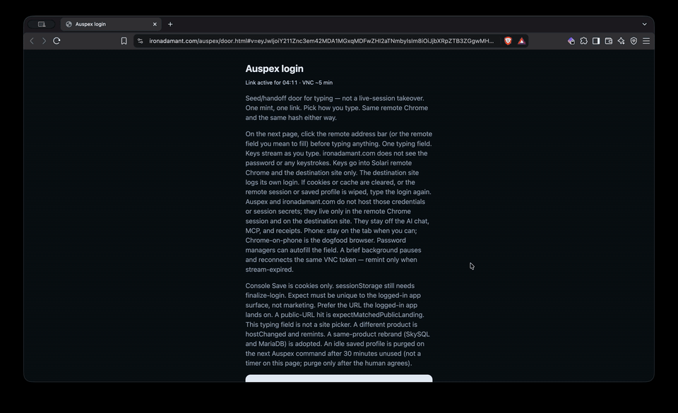

# Auspex

Agents often say a page loaded when it is still a login screen. Auspex opens the site in Solari cloud Chrome (a browser Solari runs in their cloud, not on your computer), checks the claim, then checks again on a second machine. Auspex is the login-truth gate before reliable agent labor: it proves a claim about the logged-in state. It is not a demo of acting while logged in.

## For Reviewers

The ironadamant one-liner is a **measured public check** (no login). It does **not** prove logged-in honesty. **Auth-gated evidence** is the redacted demo: a redacted auth-gated SaaS demo, receipt [`consistencyhub-receipt.json`](examples/auspex-ts/demo/consistencyhub-receipt.json). Watch with no clone and no API key: https://ironadamant.com/auspex/ — the landing opens on the blurred redacted demo and the three results; the player lower on the page is the stripped Microsoft wall, not logged-in proof.

Recipe: `login --url <https>` (override `--profile <yours>`). We do not claim Alice-vs-Bob wrong-account detection. Auspex never types passwords. Never `--record` a logged-in session. The Pages landing has a short Agent door card beside Phone and Desktop. The skim under the blur names the dual pack (ConsistencyHub blur + receipt; OneDrive receipt-only). Read that pack as two truths.

| | What you see | What to do |
| --- | --- | --- |
| **Truth A** | A finished saved login. The dual pack shows `claimOkProfile` true on both hosts. | A later independent check can reuse that seed. Evidence, not the recipe. |
| **Truth B** | Save returned 200. The app is already on the remote picture. The jar is still only Microsoft or Google sign-in cookies, and in-tab session storage is 0. Status `idp-only-save`, kind `app-visible`. | Do not finalize. The picture is not a saved login. Solari handoff Save stores cookies and local storage. It cannot read the in-tab session token. That is not Auspex broken, and it is not a reason to mint login again to finish Microsoft. |

`sign-in-wall` is the other kind: you are still on the Microsoft or Google page. Finish that sign-in, land on the app, then Save. That one mints again. `app-visible` does not. If the jar already includes the app host and Save could not refresh in-tab session storage, run finalize-login now. That case is not Truth B.

**Issues** is on. The weekly public job still skips if the secret is unset. Do not remove it. Repo `SOLARI_API_KEY` is **present** (masked). Observed: [Actions 35605123361](https://github.com/IronAdamant/auspex/actions/runs/35605123361) (2026-09-21) ironadamant + checkpoint `ok: true`.

Three results come back. They are separate.

- `ok` means the live browser matched the claim, and the second check passed when it ran.
- `claimOk` means an anonymous second machine saw the claim, with no saved login.
- `claimOkProfile` means a second browser that reused the saved login saw the claim. After `--verify-with-profile`, **`claimOkProfile` is the reuse gate**. `ok` alone is not enough to treat the profile as reusable.

## Login doors (Phone and Desktop)

**Phone** — Auspex login, then the Phone door, then remote Chrome on a Google New Tab. The phone page has a real text field because Solari’s remote view will not open the phone keyboard ([Solari cookbook #80](https://github.com/solari-sdk/solari-cookbook/issues/80)). You type or paste there (a password manager works). That field is the Auspex seed door. It is not a same-session takeover and it does not type into the page for the agent.


**Desktop** — Auspex login, then the Desktop door, then remote Chrome on a Google New Tab.



These pages are a seed/handoff door (you type or paste off-site), not a same-session VNC takeover, and not a full logged-in SaaS walkthrough. Show as bullets is off by default so a password manager can paste into the text field.

## 30-second public proof

**Public check** (no login). It does **not** prove logged-in honesty.

```bash
export SOLARI_API_KEY=slr_live_…   # https://console.getsolari.com — env only, never commit
npx auspex-solari check --name ironadamant
npx -p auspex-solari auspex-mcp
```

**Install `auspex-solari` (not npm `auspex`). Repo is `IronAdamant/auspex`.**

npm `auspex` is a different scraper. `auspex-solari` **0.1.3 is published** (latest). Agents do not `npm publish`.

After a git clone, run `npm install && npm run build:mcp` in `examples/auspex-ts`, or MCP fail-closes with reason `DistMissing` (not an empty silent server). Published `npx -p auspex-solari auspex-mcp` includes `dist/`.

## Pick your path

| Door | Open this |
| --- | --- |
| **Watch** (no clone, no API key) | [Landing](https://ironadamant.com/auspex/) · [rrweb player](https://ironadamant.com/auspex/demo/replay.html) (Microsoft login wall; emails and passwords stripped) |
| **Auth-gated evidence** | Redacted demo [receipt](examples/auspex-ts/demo/consistencyhub-receipt.json) · [RECEIPTS.md](RECEIPTS.md) |
| **Public check** | `npx auspex-solari check --name ironadamant` — does **not** prove logged-in honesty |
| **Any site** | `npx auspex-solari check https://example.com --expect "Example Domain"` |
| **Microsoft login** | 1. `npx auspex-solari login --url <https>` (override `--profile <yours>`). 2. Open `handoff.url` (Phone: `handoff.mobileUrl`, Desktop: `handoff.desktopUrl`). 3. You sign in and tap Save. 4. `await-login --save-editor`, then `auspex_finalize_login`. Saved-check names supply URL and expect; unknown profiles require `--url` and `--expect`. [Frozen door sequence](AGENTS.md#frozen-agent-door-sequence). Never `--record`. |
| **MCP** | `npx -p auspex-solari auspex-mcp` — Cursor config below |
| **Hands-off job** | `npx auspex-solari job --url <https> --expect "<unique logged-in text>"`, then `job-status` |
| **Do not** | Type passwords · `--record` a logged-in session · commit `SOLARI_API_KEY`, `.env`, or `.auspex/` |

Anonymous verify is skipped for any attached profile on a non-public-marketing URL. Login, finalize, profile-status, reap, and trace are the auth + hygiene doors. The named Solari sandbox Mousepad demo is not your computer (402 on Free).

Save is not sessionStorage. A Save that stored cookies did not store the app token. `weakSeed` is cookies or site data with a counted `sessionStorage === 0`, or a stale fold. `emptySave` means the profile is missing. `--verify-with-profile` is refused on `weakSeed`, `emptySave`, and a dead fold (no second browser). `ok` ≠ `claimOk` ≠ `claimOkProfile`.

Login trace writes one post-handoff row. Check rows are not written. Never tokens, passwords, or session ids. If mint is silent, read `npx auspex-solari trace` before minting again.

## MCP

Cursor, using the published package (this build already includes the server files). Put `SOLARI_API_KEY` in `env`.

```json
{
  "mcpServers": {
    "auspex": {
      "command": "npx",
      "args": ["-p", "auspex-solari", "auspex-mcp"],
      "env": {
        "SOLARI_API_KEY": "slr_live_…"
      }
    }
  }
}
```

Claude and Grok configs: [package README](examples/auspex-ts/README.md#mcp).

## When a check refuses

- The claim appeared on a public login or marketing page, so the profile was not saved (`expectMatchedPublicLanding`). Use the real app URL and text that only the logged-in app shows.
- The live site moved to a different host than the one minted into the door (`hostChanged`). Mint login again. Leave the old profile alone.
- The remote typing window expired and the profile has no cookies (`stream-expired`). Mint again. If save returned 200 but could not refresh in-tab session storage, and the jar already includes the app host, run finalize-login now. An IdP-only jar with the app already on screen is Truth B above: do not finalize.
- Solari HTTP status codes are a separate list from a logged-out page. See [AGENTS.md](AGENTS.md#blame-solari-vs-auspex).
- Stealth applies only when a check opens a session (`auspex check --stealth`). Login mint cannot request it. The cold login handoff and the profile editor ignore a stealth body (same handoff, no 402). Do not add `auspex login --stealth`.

## Logged-in evidence

Blurred dashboard from a real logged-in app. The blur hides personal data. The name in the file path is a worked example, not the recipe for every site.


On that receipt: `ok=true` (the live check passed), `claimOk=false` (the anonymous second machine was skipped), `claimOkProfile=true` (the saved login saw the claim). OneDrive is a receipt only (no raw screenshot). That pair is Truth A. Truth B is in [For Reviewers](#for-reviewers): a dashboard already on screen with an IdP-only jar is `idp-only-save` / `app-visible`. Do not finalize that jar.

## Worked example (dogfood)

Evidence only — not the first command. Use the published package.

```bash
npx auspex-solari login --profile consistencyhub
npx auspex-solari await-login --profile consistencyhub --save-editor
npx auspex-solari finalize-login --profile consistencyhub
npx auspex-solari check --name consistencyhub --verify-with-profile
```

Full fence: [package README](examples/auspex-ts/README.md#worked-example-dogfood).

## Links

Auspex is check and verify honesty on Solari, not a second Solari SDK tutorial. Deep contract: [AGENTS.md](AGENTS.md).

- Reviewer skim: [docs/REVIEWER-5MIN.md](docs/REVIEWER-5MIN.md)
- Agent contract: [AGENTS.md](AGENTS.md) · quick card: [llms.txt](llms.txt)
- Receipts: [RECEIPTS.md](RECEIPTS.md) · thesis: [PITCH.md](PITCH.md)
- Apply path (Harry Chow, LinkedIn 2026-08-31): fork the cookbook, ship a real Solari use case, make the repo public, and tag @harrychow_ @getsolari on LinkedIn or X. The tagged post is founder-only.
- Console — [console.getsolari.com](https://console.getsolari.com) · Docs — [docs.getsolari.com](https://docs.getsolari.com)

## Upstream cookbook

This repo is a public fork of the Solari cookbook. The submission is [examples/auspex-ts](examples/auspex-ts). Other folders under [`examples/`](examples/) are the original Solari samples. In those TypeScript samples, call `await solari.close()` or the process hangs.

MIT licensed.
