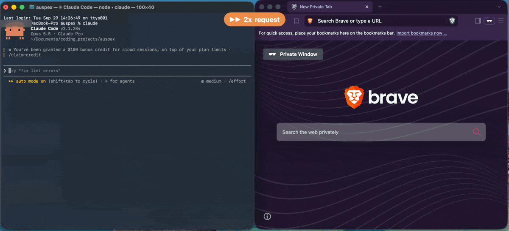
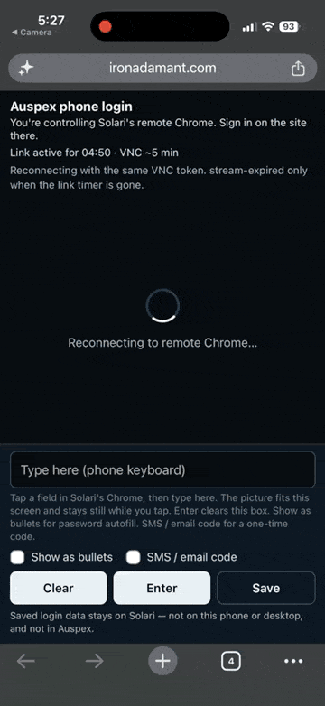

# Auspex

**Proof that an AI agent really saw a web page, including pages behind a login.**

[](https://ironadamant.com/auspex/video/auspex-demo-31s.mp4)

*31-second demo: an AI agent logs in to a real app. A person signs in once; the agent never sees the password. Sped-up parts are marked on screen. Click it for the sharper video.*

## The problem

AI agents can say "the dashboard loaded" when the page is really still a login screen, or when they never looked at all. For anything behind a login it is worse: the agent would need your password.

## What Auspex does

1. **Opens the website in a separate browser in the cloud** (run by [Solari](https://getsolari.com)), not on your computer.
2. **Looks for the exact words you expect** on the page, and keeps a screenshot and a record of what it found (a "receipt").
3. **Checks a second time, independently**, so one lucky look is not enough. A public page is checked again with a plain fetch and no login. A logged-in page is checked again with a second browser only when you ask (`--verify-with-profile`); `connect` always does.
4. **For sites that need a login, you sign in once yourself**, on a simple web page that works on your phone or computer. The AI never sees your password. A fresh browser then proves the saved login really works before Auspex calls it reusable.
5. **It can also confirm that an agent's change really happened.** After an agent made a Trello card, a fresh browser using only the saved login found it on the board; after it wrote a ConsistencyHub document, a fresh browser reopened it and saw the text. The click is not the proof; the second look is.

Auspex never types passwords and never records a logged-in session. It does not claim to spot the wrong account (Alice-vs-Bob): a saved login can belong to the wrong person and still show the words you asked for.

## For Reviewers

- **Watch, no install:** the video above, or https://ironadamant.com/auspex/ (a blurred logged-in page and its receipt).
- **Run the tests, no API key:** clone the repo, then `npm install && npm test`.
- **One live check (needs a Solari key, `SOLARI_API_KEY`):** `npx auspex-solari check --name ironadamant`. This is a public check with no login, so it does not prove the logged-in part.
- **Logged-in evidence:** the live test of real apps [below](#tested-on-live-apps) (28 September, plus Trello's Google sign-in on 1 October), with its receipt-only files in [RECEIPTS.md](RECEIPTS.md#other-sign-in-receipts-receipt-only), and the one-command run the next day. The blurred ConsistencyHub still and its [receipt](examples/auspex-ts/demo/consistencyhub-receipt.json) are from 19 September.
- **Your own site:** `npx auspex-solari connect https://your.app --expect "Words only shown when logged in"` (or step by step with `login --url https://your.app`).
- **From your AI assistant (MCP):** `npx -p auspex-solari auspex-mcp`, setup [below](#mcp).
- **CI:** Issues are on. The weekly live job skips without a key; repo secret `SOLARI_API_KEY` is **present**. Run [36789267135](https://github.com/IronAdamant/auspex/actions/runs/36789267135) checked ironadamant.com with the published package: `ok` and `claimOk` true. The run page shows the table, and the receipt is committed as [demo/ironadamant-receipt.json](examples/auspex-ts/demo/ironadamant-receipt.json). Every push also installs the packed package and runs it end to end.

## Three answers on every receipt

Each receipt keeps three answers apart, so a "yes" is never stretched to mean more than it does:

- **The live browser saw your words.** (`ok`)
- **A plain fetch, with no login, also saw them.** (`claimOk`) On a logged-in app this stays "no" on purpose.
- **A second fresh browser, using only the saved login, saw them.** (`claimOkProfile`) This is the reuse gate: `ok` alone is not enough to treat the profile as reusable.

## Tested on live apps

On 2026-09-28 a person signed in once per site on the login page, and an AI agent (Claude Code) did the rest. Real accounts; nothing was changed apart from a few menu clicks. The last row, Trello, was added on 2026-10-01; that run also made one test card.

| Sign-in system | Kind of app | Login confirmed by a second browser? |
| --- | --- | --- |
| Appwrite | Class booking | Yes |
| Supabase | Audio transcription | Yes |
| AWS | Language learning | Yes |
| Cloudflare + Clerk | Collaborative whiteboard | Yes |
| Postgres | Customer-support inbox | Yes |
| MySQL | Database console | Yes |
| MongoDB (Parse) | App-backend dashboard | Yes |
| Microsoft sign-in | ConsistencyHub (our own app) | Yes, after one extra step |
| Google sign-in (Atlassian account) | Task boards: Trello, 2026-10-01 ([receipt](examples/auspex-ts/demo/trello-receipt.json)) | Yes, first time |

Eight of eight on 28 September, on a laptop and on a phone, and Trello on 1 October. When a login was not really saved, Auspex said so instead of guessing.

The next day (2026-09-29) the same apps plus Canva (Google sign-in) ran again with the one-command version: eight of nine confirmed. Canva is not confirmed because it shows every cloud browser an "are you a robot?" check, and Auspex reports that honestly. Trello is the confirmed Google sign-in: on 2026-10-01 it logged in first time, and the same saved login then made a card with one click that both browsers saw on the board. Every attempt: [RECEIPTS.md](RECEIPTS.md#one-command-run-with-connect-2026-09-29).

On 2026-09-30, on that day's release (0.1.24), ConsistencyHub and tldraw logged in end to end again, and the tldraw login then passed a repeat check, a four-page sweep, and the MCP tool ([RECEIPTS.md](RECEIPTS.md#rechecked-on-the-current-release-2026-09-30)).

Worth knowing before pointing it at your own app: opening a logged-in page still runs the site as normal (a chat app showed the account as online), and some drawing apps finish drawing after the page looks ready.

## How signing in works

Auspex gives you a link to its login page. Open it on your phone or computer: it shows the cloud browser, and the typing box at the bottom opens your phone keyboard. Sign in to the site as usual, wait for the app to load, then **tap Save** and tell your AI agent "saved" (or paste the short line it copies). The agent does the rest.

<a href="https://ironadamant.com/auspex/video/auspex-phone-door-10s.mp4"></a>

*10 seconds on a real phone: typing in the box at the bottom drives the cloud browser above it. Sped-up parts are marked on screen.*

The sign-in window lasts about five minutes (Solari's limit), so save as soon as the app appears. The saved login lasts much longer. Your password goes only to the cloud browser and the site, never to the agent, the chat, or ironadamant.com.

## Two truths about Save

1. **A saved login is ready to reuse only when a later check proves it.** A second fresh browser opens the app with the saved login and sees your words.
2. **What is on screen can be ahead of what was saved.** Some apps (especially Microsoft sign-in) show the app before Save has all of the login. When only the app's own session is missing, one extra step captures it (that was ConsistencyHub). When Save holds only the Microsoft or Google sign-in, there is no extra step: Auspex stops and says so instead of pretending.

## What one check can do

One check can fill one field and click one control. A later check starts a new browser, so a form opened in the first check is not still open.

`--allow-page-actions` does not raise that ceiling. A dialog, a typed field, and a submit are three steps. Stage the page, then have a person finish it. One click is one click.

A saved login is ready to reuse only when a later check sees the logged-in page. The short version is [Two truths about Save](#two-truths-about-save). The full rules are in [AGENTS.md](AGENTS.md).

## For developers

### Install

```bash
export SOLARI_API_KEY=slr_live_…   # https://console.getsolari.com. Keep it in the environment; never commit it.
npx auspex-solari check https://example.com --expect "documentation examples"
npx auspex-solari connect https://your.app --expect "Words only shown when logged in"
```

The npm package is **`auspex-solari`** (npm `auspex` is a different project). `auspex-solari` **0.1.29 is published**. From a clone: `npm install && npm run build:mcp`, then `npx auspex …`. CLI and MCP share one contract; it works with Claude Code, Cursor, Grok and other MCP hosts.

`connect` runs the whole login in one command: it prints the login link and time left, you press **Enter** in the terminal after signing in (an agent runs `connect --save <profile>` instead), and it ends with one sentence that says "Logged in" only when a second browser confirmed it. Step by step it is `login --url` → sign in and Save → `await-login --save-editor` → `finalize-login` → `check --verify-with-profile` ([frozen door sequence](AGENTS.md#frozen-agent-door-sequence)). The login page is a seed/handoff door for typing off-site, not a same-session VNC takeover of the agent's browser.

Built around real Solari limits, each with a named failure and a recovery step: no phone keyboard in Solari's remote view ([cookbook #80](https://github.com/solari-sdk/solari-cookbook/issues/80)), SDK retries that lose the HTTP status ([#56](https://github.com/solari-sdk/solari-cookbook/issues/56)), 18 concurrent browsers where 20 are advertised ([#57](https://github.com/solari-sdk/solari-cookbook/issues/57)), no session listing ([#61](https://github.com/solari-sdk/solari-cookbook/issues/61)), and sessions that look alive after they end ([#25](https://github.com/solari-sdk/solari-cookbook/issues/25)).

### MCP

Local program, key in `env`:

```json
{
  "mcpServers": {
    "auspex": {
      "command": "npx",
      "args": ["-p", "auspex-solari", "auspex-mcp"],
      "env": { "SOLARI_API_KEY": "slr_live_…" }
    }
  }
}
```

Claude Code: `claude mcp add --transport stdio auspex --env SOLARI_API_KEY=slr_live_… -- npx -p auspex-solari auspex-mcp`. Grok, Qwen Code, Kimi Code, DeepSeek Harness, OpenHands: [docs/HOSTS.md](docs/HOSTS.md). A sign-in wait can outlast a host's tool timeout; agents use `auspex_job` then `auspex_job_status`.

## Worked example (dogfood)

ConsistencyHub (Microsoft sign-in), step by step:

```bash
npx auspex-solari login --profile consistencyhub
npx auspex-solari await-login --profile consistencyhub --save-editor
npx auspex-solari finalize-login --profile consistencyhub
npx auspex-solari check --name consistencyhub --verify-with-profile
```

## Links

[RECEIPTS.md](RECEIPTS.md) · [CHANGELOG.md](CHANGELOG.md) · [docs/REVIEWER-5MIN.md](docs/REVIEWER-5MIN.md) · [docs/ops-runbook.md](docs/ops-runbook.md) · [docs/HOSTS.md](docs/HOSTS.md) · Solari [console](https://console.getsolari.com) and [docs](https://docs.getsolari.com)

This repo is a fork of the Solari cookbook; Auspex lives in [examples/auspex-ts](examples/auspex-ts), and the other folders under `examples/` are the original Solari samples. MIT licensed.

**AI agents:** start with [AGENT-CARD.md](AGENT-CARD.md) (one page), then [AGENTS.md](AGENTS.md) for the full rules, instead of this page.
