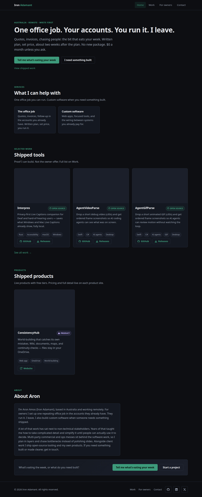

# Auspex

Web eyes for **coding agents**. An agent calls Auspex; Solari boots a **throwaway Chrome in their cloud** (not on your Mac); the agent gets JSON + a PNG; the session is killed. You do not sit in that browser.

This is not Browser Use, not local Playwright, and not a tab in your Chrome. Humans only see the receipt (stdout, screenshot, optional replay) and, if a login is needed, a **single-use login-handoff URL** to sign in and Save once.

Use it when a live page, JS paint, a login, or an audit still is the point. Do not use it to scrape at scale.

## How this was built

Grok 4.6 in Grok Build wrote the CLI, MCP server, and Solari wiring. I pointed it at the intern challenge, the cookbook, and my own sites (ironadamant.com, Checkpoint, ConsistencyHub). AI used: the Solari SDK, not a stub; Microsoft SSO click-through after a real console profile save; Grok MCP handshake (Content-Length + absolute `node`). I ran the live checks, saved the Solari profile, and wrote the public post. Private research notes never left this machine.

Public receipt of a **`--record`** check on a JS page (ironadamant.com, not a login):

- Still: [demo/ironadamant.png](demo/ironadamant.png)
- JSON + `sessionId`: [demo/receipt.json](demo/receipt.json)
- 60-second watch: [demo/replay.html](demo/replay.html) (rrweb of that Solari session). After this is on `main`: [htmlpreview](https://htmlpreview.github.io/?https://github.com/IronAdamant/auspex/blob/main/examples/auspex-ts/demo/replay.html).
- Same recording in **your** Solari org: [console](https://console.getsolari.com) → Sessions → that `sessionId` → Replay.

`--record` does not put a presigned replay URL on the JSON receipt. Do not `--record` a logged-in ConsistencyHub session (recordings capture input).



Official Solari MCP is **optional and gated**: `dist/solari-mcp.mjs` starts `@solarisdk/mcp` only when `SOLARI_API_KEY` is set (env or `.env`). No key → process exits and Grok does not list `solari_*` tools. See `grok.mcp.example.toml` (`[mcp_servers.solari]`). Prefer Auspex for check → verify → close/kill; use Solari MCP for ad-hoc drive. Always close/kill those sessions.

## Run

```bash
cd examples/auspex-ts
npm install
# Persist the key for CLI *and* Grok (this file is gitignored). `export` in another terminal does not reach Grok.
printf 'SOLARI_API_KEY=%s\n' "$SOLARI_API_KEY" > .env
npx tsx src/cli.ts check https://ironadamant.com --expect "Build it."
npx tsx src/cli.ts verify
```

Always close the browser session (the CLI does this in `finally`) and **kill** the sandbox VM (`verify` does this in `finally`; `close()` is not teardown). Never commit `.env`, the API key, or `.auspex/` run artifacts.

### Commands

```
npx tsx src/cli.ts check <url> --expect <string> [--selector <css>] [--profile <name>] [--stealth] [--record] [--allow-record-profile] [--sso] [--verify]
npx tsx src/cli.ts verify [runDir]
npx tsx src/cli.ts desktop [--open <app>] [--type <text>] [--click <x,y>]
npx tsx src/cli.ts login --profile <name> [--url <hint>]
npx tsx src/cli.ts profiles
```

`login` creates or reuses a named Solari profile and prints a **login-handoff `url`**. Open that URL (single-use; the agent never handles the password), sign in, Save. Then `check --profile <name>`. Login does not hold an Auspex check session open.

`--stealth` needs Starter or higher (402 FeatureRequiresPlan on Free — not retryable). `--profile` loads the Solari profile into the page context (cookies are not on the default context). `--sso` clicks **Sign in with Microsoft** and the signed-in account picker. Checks do not overwrite the profile. `record`+`profile` is forbidden unless `--allow-record-profile`.

**429 ConcurrencyLimitExceeded is not retryable.** Call `solari_browser_close` / `solari_kill` (or let Auspex finish teardown) to free leftover sessions, then retry.

**Browser then sandbox:** `check` writes `.auspex/runs/<stamp>/{manifest.json,screenshot.png}`. `verify` (or `check … --verify`) boots a **headless** Solari microVM, uploads that receipt (max 2 MiB), and **kills** the VM. Integrity (`ok`/`errors`: PNG magic/size, path, auth URL) is separate from claim (`claimOk`/`claimErrors`). A missed claim can still be a valid receipt. `--verify` on check is one-shot — do not also run `verify`. Optional `[runDir]`; default is the latest run. The sandbox never opens ConsistencyHub.

Stdout for `check` is JSON: `title`, `finalUrl`, `ok`, `expect`, `matched`, `excerpt`, `screenshotPath`, `sessionId`, `networkIdle`. Files land in `.auspex/runs/<timestamp>/`. `--record` does not put a presigned replay URL on the receipt (watch in the Solari console via `sessionId`). Refresh the public demo with `npx tsx scripts/save-demo-receipt.ts`.

## MCP (Grok)

Two servers, one key. Copy both tables from [grok.mcp.example.toml](grok.mcp.example.toml) into `~/.grok/config.toml`. Commands are **absolute `node` + absolute paths** under `examples/auspex-ts/dist/`. Run `npm run build:mcp` after changing `src/`. Restart Grok so tools appear.

**Auspex** (`dist/mcp.mjs`) — always-teardown check:

- `auspex_check` — JSON + JPEG attach (optional `verify=true` is one-shot check-then-sandbox; do not also call `auspex_verify`)
- `auspex_verify` — headless VM audits integrity `ok` vs claim `claimOk`, then **kill**
- `auspex_login` — login-handoff URL / `auspex_profiles`
- `auspex_desktop` — Solari GUI VM, one computer-use action, screenshot, **kill**. ASCII log **and** JSON. No VNC.

Live: ironadamant.com (`Build it.`), checkpointprojects.com (`Checkpoint`), consistencyhub.io (`Document Editor` + saved `--profile`).

**Solari official** (`dist/solari-mcp.mjs` → `@solarisdk/mcp`) — ad-hoc browser / sandbox / desktop. Starts **only if** `SOLARI_API_KEY` is in env or `.env`; otherwise the process exits and Grok does **not** list `solari_*` tools. Prefer Auspex for check → verify → close. If `solari_*` are present: always `solari_browser_close` / `solari_kill` (sandboxes **pause** unless killed).

See [AGENTS.md](AGENTS.md) and [DEMO.md](DEMO.md).
